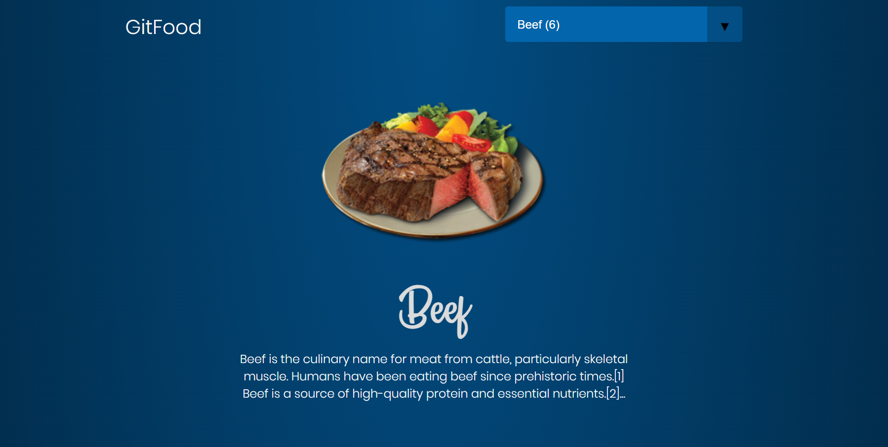
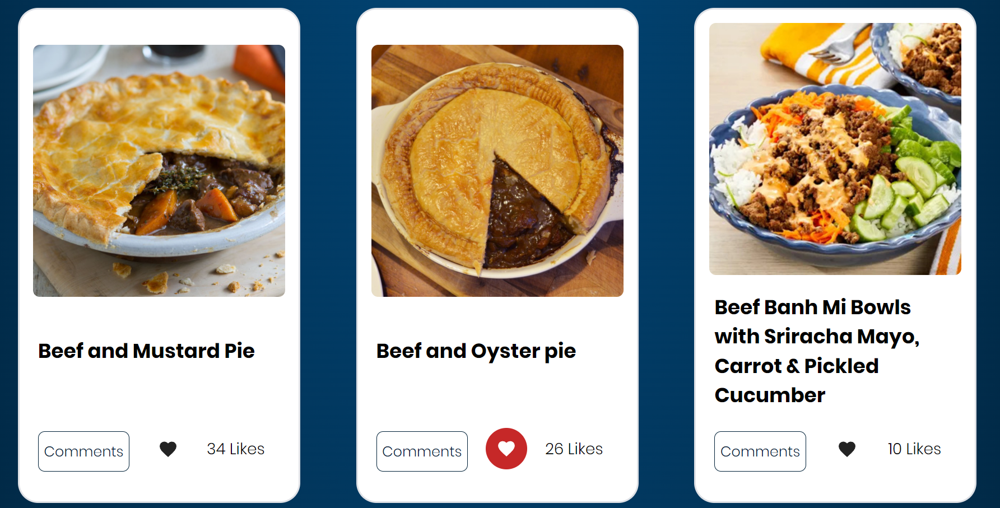
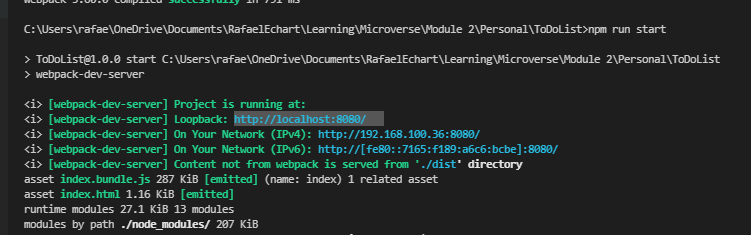

# 

# Restaurant Capstone

> Restaurant Capstone Project

## Built With

- HTML, SCSS/CSS, and Javascript
- [themealdb API](https://www.themealdb.com/api.php)
- [Involvement API](https://www.notion.so/microverse/Involvement-API-869e60b5ad104603aa6db59e08150270) Our API unique ID is: `xFhLPbE0OxSNE2QeBp9w`
- [Webpack](https://webpack.js.org/)
- [Jest](https://jestjs.io/)
- [Linters](https://github.com/microverseinc/linters-config/blob/master/html-css-js/.github/workflows/linters.yml)

## Live Demo

[Live Demo Link](https://infallible-feynman-bae919.netlify.app/)

## Capstone Overview

[Watch video](https://drive.google.com/file/d/1tcHf2zilMFW-HCkPU4PMbI2r1AYlN-O1/view)

## Getting Started

To get a local copy up and running follow these simple example steps.

### Prerequisites

- Node js installed
- Terminal
- Browser of your preference

### Setup

- git clone https://github.com/RafaelEchart/React_RestaurantMenu.git
- cd React_RestaurantMenu

### Install

Inside of your directory run the following commands:

- npm install
- npm run build
- npm run start

### Usage

- Open your browser in http://localhost:8080/ or the port that says the CLI

### How to edit

If you wish to edit this project you need to run the following command too:

- `npm run watch`

This will allow you to see a hot refresh in the browser when your HTML changes.

### Run tests

Run the following command to run the tests: `npm run test`

## Authors

👤 **Rafael Echart**

- GitHub: [@rafaelechart](https://github.com/rafaelechart)
- Twitter: [@rafaechart](https://twitter.com/rafaechart)

👤 **Amr Ahmed**

- GitHub: [@Amrhub](https://github.com/Amrhub/)
- LinkedIn: [Amr Ahmed](https://www.linkedin.com/in/amr-ahmed-655420191/)

## 🤝 Contributing

Contributions, issues, and feature requests are welcome!

## Show your support

Give a ⭐️ if you like this project!

## Acknowledgments

- Rafael Echart⭐️
- Amr Ahmed⭐️
- Microverse documentation ⭐️
- Microverse team ⭐️
- mealdb API ⭐️
- involvement API ⭐️

## 📝 License

This project is [MIT](./MIT.md) licensed. -->
